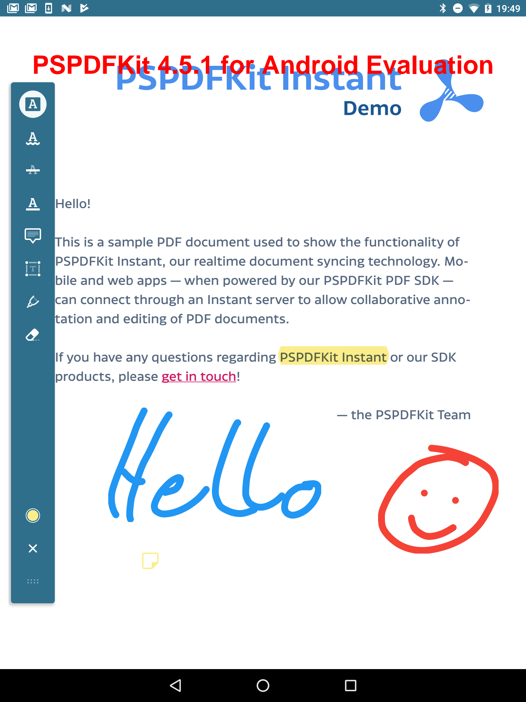
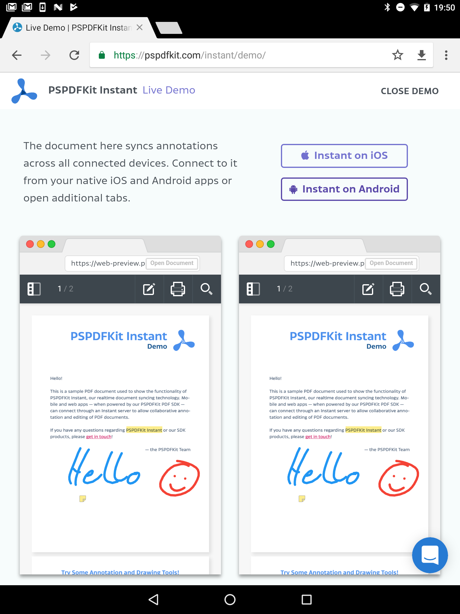
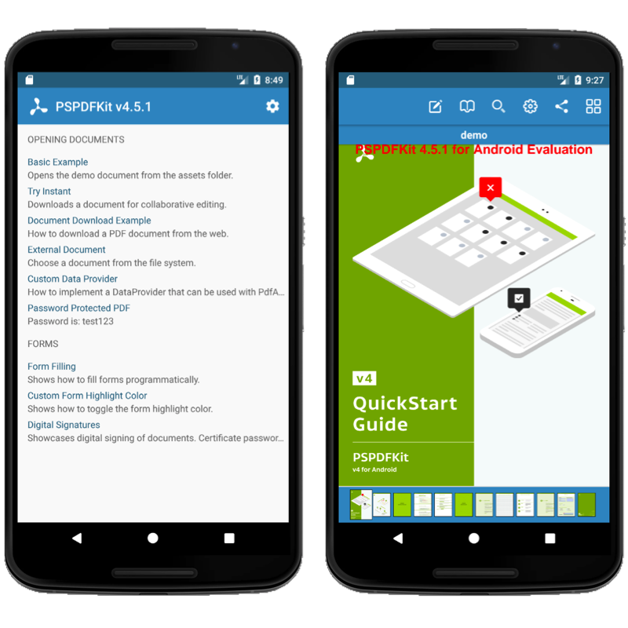
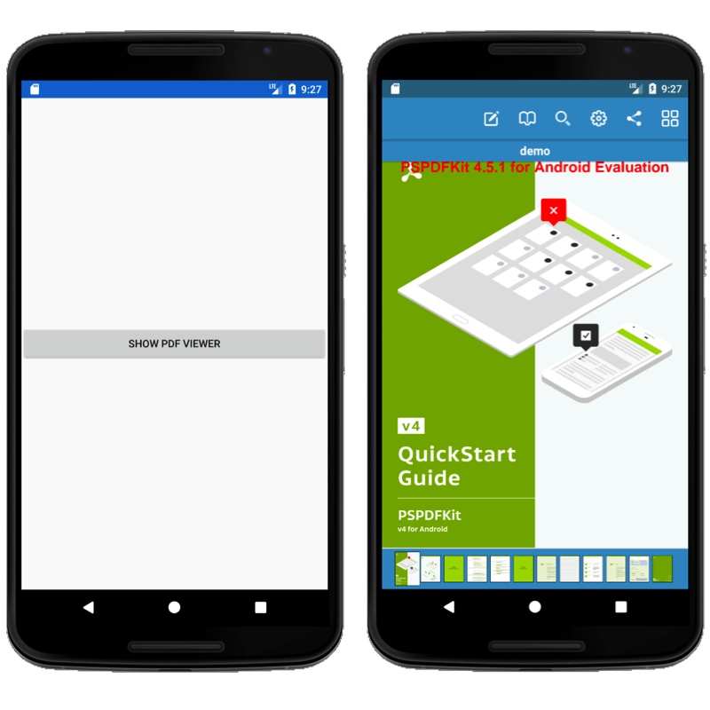
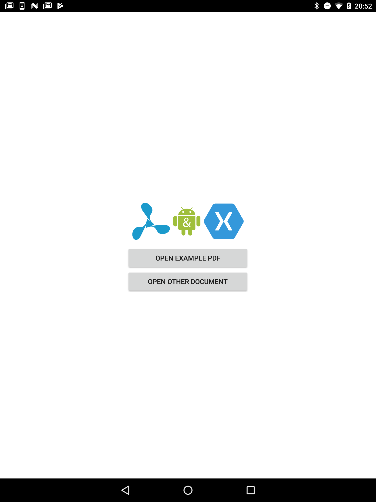

# Xamarin PSPDFKit.Android Bindings

Xamarin.Android Bindings for PSPDFKit `v6.5.0`.

#### PSPDFKit

The [PSPDFKit SDK](https://pspdfkit.com/) is a framework that allows you to view, annotate, sign, and fill PDF forms on iOS, Android, Windows, macOS, and Web.

[PSPDFKit Instant](https://pspdfkit.com/instant) adds real-time collaboration features to seamlessly share, edit, and annotate PDF documents.

#### Related

- Xamarin.iOS Bindings for PSPDFKit for iOS: [PSPDFKit/Xamarin-iOS](https://github.com/PSPDFKit/Xamarin-iOS)
- Xamarin Bindings for PSPDFKit for Windows UWP: [PSPDFKit/Xamarin-UWP](https://github.com/PSPDFKit/Xamarin-UWP)

## Support, Issues and License Questions

PSPDFKit offers support for customers with an active SDK license via https://pspdfkit.com/support/request/

Are you evaluating our SDK? That's great, we're happy to help out!
To make sure this is fast, please use a work email and have someone from your company fill out our sales form: https://pspdfkit.com/sales/

## Requirements

PSPDFKit runs on Android devices running:

* **Xamarin.Android >= 9.4.1.0**
* **Microsoft Mobile OpenJDK 1.8.0**
* Android **4.4** or newer / API level **19** or higher
* 32/64-bit ARM (armeabi-v7a with NEON/ arm64-v8a) or 32/64-bit Intel x86 CPU.
* Projects using PSPDFKit.Android.dll **must** set [Target Framework](https://developer.xamarin.com/guides/android/application_fundamentals/understanding_android_api_levels/#framework) to **API 28 (Android 9.0)**.
* In your Android Options select `d8` as your `Dex compiler`. Otherwise you will get errors about default interface methods not being supported.

## Integrating PSPDFKit

There's 2 ways to integrate PSPDFKit into your project. We highly recommend using our nuget packages from nuget.org in Visual Studio as it requires less work for the customer and also eliminates the possibility of build errors, which can happen from time to time.

### Integrating PSPDFKit via Nuget (Recommended)

1. Right-Click on your project in Visual Studio and select "Manage Nuget Packages…"
2. In the `Browse` section for "nuget.org" search for "PSPDFKit"
 

3. Select the `PSPDFKit.Android` package.
4.  Tap on "Add Package" to add the nuget package to your project.

Now you are done and can skip to [Adding additional resources!](https://github.com/PSPDFKit/Xamarin-Android#adding-additional-resources)

### Integrating PSPDFKit via DLLs (Advanced)

#### Step 1 - Get PSPDFKit .aar File

1. Download PSPDFKit from your [customer portal](https://customers.pspdfkit.com) if you haven't done so already, or [request an evaluation version](https://pspdfkit.com/#trynow).
2. Unzip the file you downloaded above and copy `pspdfkit-x.x.x.aar` to [`PSPDFKit.Android/Jars`](PSPDFKit.Android/Jars) folder.
3. Run `./build.sh` (on macOS) or `./build.ps1` (on Windows, PowerShell) command from root directory. This will download additional resources needed by the binding. Note that running this will require you to have [Xamarin](https://www.xamarin.com/platform) already installed on your computer.

**💡 Note:** Ensure the files are really named `pspdfkit-x.x.x.aar` so there is no hidden `.zip` file ending. OS X likes to add these things and doesn't show them by default. Use the Inspector to be sure.

Visual Studio will use the default Java, but this can be customized in Preferences -> SDK Locations -> Java SDK (JDK).

#### Step 2 - Get your Dlls

You have two options to get it:

#### Build from PSPDFKit.Android.sln

1. Open `PSPDFKit.Android.sln` in `Visual Studio`.
2. Build the project.
3. Get the dll from the `PSPDFKit.Android/bin` folder.
4. Enjoy.

#### Build from Terminal

1. Just grab `PSPDFKit.Android.dll` from the root folder, if you successfuly followed **Step 1** it should be there.
2. Enjoy.

#### Integrating the dlls into your own Project

In order to use **PSPDFKit.Android.dll** with your own project you will need to add the dll as a reference to your project. You can achieve this by doing the following:

1. Right click in your **References** folder from your project and select **Edit References...**
2. Select **.Net Assembly** tab and click **Browse**
3. Locate your **PSPDFKit.Android.dll** copy and add it.

### Adding additional resources

First you need to add the [pspdfkit-proguard.cfg](samples/AndroidSample/AndroidSample/pspdfkit-proguard.cfg) file to your project, see [Xamarin Android and ProGuard](#xamarin-android-and-proguard) section.

**💡 Note:** If you do not add the [pspdfkit-proguard.cfg](samples/AndroidSample/AndroidSample/pspdfkit-proguard.cfg) file to your project you will run into errors

Once you have done this you will need to add some [NuGet](https://www.nuget.org/) packages to you project

* [Xamarin.AndroidX.Legacy.Support.V4](https://www.nuget.org/packages/Xamarin.AndroidX.Legacy.Support.V4)
* [Xamarin.AndroidX.AppCompat](https://www.nuget.org/packages/Xamarin.AndroidX.AppCompat)
* [Xamarin.AndroidX.RecyclerView](https://www.nuget.org/packages/Xamarin.AndroidX.RecyclerView)
* [Xamarin.AndroidX.CardView](https://www.nuget.org/packages/Xamarin.AndroidX.CardView)
* [Xamarin.AndroidX.GridLayout](https://www.nuget.org/packages/Xamarin.AndroidX.GridLayout)
* [Xamarin.AndroidX.Palette](https://www.nuget.org/packages/Xamarin.AndroidX.Palette)
* [Xamarin.AndroidX.MultiDex](https://www.nuget.org/packages/Xamarin.AndroidX.MultiDex)
* [Xamarin.AndroidX.Lifecycle.LiveData](https://www.nuget.org/packages/Xamarin.AndroidX.Lifecycle.LiveData)
* [Xamarin.AndroidX.Browser](https://www.nuget.org/packages/Xamarin.AndroidX.Browser)
* [Xamarin.Google.Android.Material](https://www.nuget.org/packages/Xamarin.Google.Android.Material)
* [Square.OkHttp3](https://www.nuget.org/packages/Square.OkHttp3)
* [Xamarin.Kotlin.StdLib](https://www.nuget.org/packages/Xamarin.Kotlin.StdLib)
* [Xamarin.Android.ReactiveX.RxAndroid](https://www.nuget.org/packages/Xamarin.Android.ReactiveX.RxAndroid)
* [Xamarin.Android.ReactiveX.RxJava](https://www.nuget.org/packages/Xamarin.Android.ReactiveX.RxJava)

If you need to know how to add NuGet packages to your Xamarin project please refer to [Walkthrough: Including a NuGet in your project](http://developer.xamarin.com/guides/cross-platform/application_fundamentals/nuget_walkthrough/) from Xamarin site.

## Usage

PSPDFKit can display documents either in a new Activity or a Fragment you include into your hierarchy.

Note that currently only local files are supported for PSPDFKit.

### Xamarin Android and ProGuard

In order to integrate ProGuard with Xamarin you can read the following [documentation on Xamarin's Site](https://developer.xamarin.com/guides/android/deployment,_testing,_and_metrics/proguard/).

Starting PSPDFKit v6.1.0 you will need to add the [pspdfkit-proguard.cfg](samples/AndroidSample/AndroidSample/pspdfkit-proguard.cfg) file to your project's root directory and then add two entries in your project's csproj as follows:

First, inside your [DEBUG configuration](https://github.com/PSPDFKit/Xamarin-Android/blob/master/samples/AndroidSample/AndroidSample/AndroidSample.csproj#L35) property group:

```xml
<PropertyGroup Condition=" '$(Configuration)|$(Platform)' == 'Debug|AnyCPU' ">
  ...
  <AndroidR8ExtraArguments>--pg-conf "$(MSBuildProjectDirectory)\pspdfkit-proguard.cfg"</AndroidR8ExtraArguments>
</PropertyGroup>
```

The above assumes that the [pspdfkit-proguard.cfg](samples/AndroidSample/AndroidSample/pspdfkit-proguard.cfg) file is in your root project directory, if not adjust the value file path to match your own scenario.

Second, add the [pspdfkit-proguard.cfg](samples/AndroidSample/AndroidSample/pspdfkit-proguard.cfg) file via the following item group to your csproj as shown [here](https://github.com/PSPDFKit/Xamarin-Android/blob/master/samples/AndroidSample/AndroidSample/AndroidSample.csproj#L137):

```xml
<ItemGroup>
  <ProguardConfiguration Include="pspdfkit-proguard.cfg" />
</ItemGroup>
```

Again the above assumes that the [pspdfkit-proguard.cfg](samples/AndroidSample/AndroidSample/pspdfkit-proguard.cfg) file is in your root project directory, if not adjust the value file path to match your own scenario.

**💡 Note:** If you do not add the [pspdfkit-proguard.cfg](samples/AndroidSample/AndroidSample/pspdfkit-proguard.cfg) file to your project you will run into errors like the following:

```
R8 : warning : Missing class: org.conscrypt.ConscryptHostnameVerifier
R8 : warning : Missing class: com.android.tools.lint.detector.api.Detector
R8 : warning : Missing class: com.android.tools.lint.detector.api.Detector$UastScanner
R8 : warning : Missing class: com.android.tools.lint.client.api.UElementHandler
R8 : warning : Missing class: com.android.tools.lint.client.api.IssueRegistry
R8 : error : Compilation can't be completed because some library classes are missing.
```

### Checking for Compatibility

You can include PSPDFKit into applications which will be distributed to devices not supported by PSPDFkit. In that case you can attempt initializing and catch `PSPDFKitInitializationFailedException` to check for device compatibility.

```csharp
try {
	PSPDFKitGlobal.Initialize(this, "<YOUR LICENSE>");
} catch (PSPDFKitInitializationFailedException ex) {
	Console.WriteLine ("Current device is not compatible with PSPDFKit: {0}", ex.Message);
}
```

### Display PSPDFKit Activity

* Add PSPDFKit viewer activity to your applications **AndroidManifest.xml**

```xml
<application android:largeHeap="true">
    <activity android:name="com.pspdfkit.ui.PdfActivity"
              android:windowSoftInputMode="adjustNothing" />
</application>
```

>You can use android:theme attribute to customize actionbar, background and other elements of the activity theme if you so desire.

* Make sure you have `android:largeHeap="true"` property in your `<application>` tag in **AndroidManifest.xml**. Rendering PDF files is memory intensive and this property will ensure your app has enough heap allocated to avoid out of memory errors.

* Create `PdfActivityConfiguration` object and then call `PdfActivity.ShowDocument()` to display the document. Document location is expressed with an Uri object.

```csharp
var pdfDocument = Android.Net.Uri.FromFile (new Java.IO.File (Android.OS.Environment.ExternalStorageDirectory, "document.pdf"));
var configuration = new PdfActivityConfiguration.Builder("<YOUR_LICENSE>").Build();
PdfActivity.ShowDocument(this, pdfDocument, configuration);
```

>You can create an Uri object from file using `Android.Net.Uri.FromFile(File)` call or you can pass in Uri returned by [Storage Access Framework](https://developer.android.com/guide/topics/providers/document-provider.html). For all configuration options refer to included JavaDoc.

### Display PSPDFKit Fragment

* Make sure you have `android:largeHeap="true"` property in your `<application>` tag in **AndroidManifest.xml**. Rendering PDF files is memory intensive and this property will ensure your app has enough heap allocated to avoid out of memory errors.

```xml
<application android:largeHeap="true">
    ...
</application>
```

* Create `PdfConfiguration` object and then call `PdfFragment.NewInstance()` to create a new `PdfFragment` instance for a document.
* Attach the fragment to your view hierarchy. Remember that fragments are retained over configuration changes, so do not recreate fragment if it's already attached - that will lead to bugs and out of memory errors.

```csharp
var pdfDocument = Android.Net.Uri.FromFile (new Java.IO.File (Android.OS.Environment.ExternalStorageDirectory, "document.pdf"));
var configuration = new PdfConfiguration.Builder("<YOUR_LICENSE>")
	.ScrollDirection (PageScrollDirection.Horizontal)
	.Build();

var fragment = PdfFragment.NewInstance(pdfDocument, configuration);
SupportFragmentManager.BeginTransaction().Replace(Resource.Id.Content, fragment).Commit();
```

>Note that the `PdfFragment` extends `Android.Support.V4.App.Fragment` and not `Android.App.Fragment`.

### Render Page to a Bitmap

You can use PSPDFKit to render PDF to bitmaps without showing them in activities. To do that, use `PSPDFKitGlobal` and `PdfDocument` class calls.

Example:

```csharp
PSPDFKitGlobal.Initialize (this, "<YOUR LICENSE>");
try {
	var pdfDocument = PSPDFKitGlobal.OpenDocument (this, Android.Net.Uri.FromFile (new Java.IO.File(Android.OS.Environment.ExternalStorageDirectory, "document.pdf")));
	var pageToRender = 1; // This is 0-indexed, use pdfDocument.PageCount to retrieve number of pages
	var pageBitmap = pdfDocument.RenderPageToBitmap(this,
		pageToRender,
		// This is the size of bitmap that will be generated
		pdfDocument.GetPageSize (pageToRender).Width,
		pdfDocument.GetPageSize (pageToRender).Height);
} catch (IOException ex) {
	Console.WriteLine ("Failed to open PDF document: {0}", ex.Message);
}
```

### Customization

To customize `PdfActivity` UI elements, use theme based on `Theme.AppCompat`. PSPDFKit will color actionbar and other elements according to `colorPrimary` and `colorAccent` attributes. Example theme definition:

```xml
<style name="MyApplicationTheme.Theme" parent="Theme.AppCompat.Light.DarkActionBar">
    <item name="colorPrimary">@color/mymain_color</item>
    <item name="colorPrimaryDark">@color/mymain_color_dark</item>
    <item name="colorAccent">@color/mymain_color_accent</item>
</style>
```

And then it should be applied in AndroidManifest.xml:

```xml
<activity android:name="com.pspdfkit.ui.PdfActivity"
      android:windowSoftInputMode="adjustNothing"
      android:theme="@style/MyApplicationTheme.Theme" />
```

Other configuration options for UI elements (icons, element sizes) can be found in `PdfActivityConfiguration` class.

### More Information

For more documentation about PSPDFKit check out [PSPDFKit online documentation](https://pspdfkit.com/guides/android/current) and bundled Javadoc.

## Xamarin Forms

You can use PSPDFKit SDK with Xamarin.Forms in 3 ways:

1. Using a Custom PageRenderer and embedding a `PdfFragment`, see `PdfViewerPageRenderer.cs` and `PdfViewerPage.cs` inside our [provided Xamarin.Forms example](https://github.com/PSPDFKit/Xamarin-Android/tree/master/samples/XamarinForms).
2. Showing a `PdfActivity`. See [the provided Xamarin.Forms example](https://github.com/PSPDFKit/Xamarin-Android/tree/master/samples/XamarinForms) for further details.
3. Using [Xamarin.Forms embedding](https://blog.xamarin.com/unleashed-embedding-xamarin-forms-in-xamarin-native/), you can take any ContentPage and add it to your native applications. This is also showcased by our [PSPDFCatalog example app](https://github.com/PSPDFKit/Xamarin-Android/tree/master/samples/PSPDFCatalog).

# PSPDFKit Instant

Support for Instant was added with the Xamarin.Android Bindings for PSPDFKit 4.5.1 for Android.

With PSPDFKit Instant, it’s easier than ever to add real-time collaboration features to your PSPDFKit-powered app, allowing your users to seamlessly share, edit, and annotate PDF documents across iOS, Android, and web. With just a few lines of code, PSPDFKit Instant gives your users a massive productivity boost.

For more information about Instant, please have a look at our [website](https://pspdfkit.com/instant/).

# Examples

You can find several sample projects in the `samples` folder, including a catalog and Xamarin.Forms example.

## How to Run the Example Projects

1. Complete [advanced setup](https://github.com/PSPDFKit/Xamarin-Android#integrating-pspdfkit-via-dlls-advanced).
2. Open the `PSPDFKit.Android.sln` solution in Visual Studio.
3. Select the example project and device you want to run it on (alternatively you can also right-click on the project and select "Build `Project Name`").

4. Tap on the triangle on the left to run the project.

### PSPDFKit Instant Example

This example is included in the PSPDFCatalog example, but you can also find the code [here][Instant Example].

The PSPDFKit Instant example shows how easy and efficient Instant works. Just go the [Instant demo page](https://pspdfkit.com/instant/demo/) and tap on `Instant on Android`, this will show a code at step three, which you have to enter in the example on your device. Afterwards you'll be connected to the server and you can start testing!

<div id="image-table">
     <table>
  	    <tr>
      	    <td>
             
           </td>
           <td>
             
           </td>
       </tr>
    </table>
</div>


### PSPDFCatalog

The `PSPSDFCatalog` project has various little example projects in it, including a basic example, which opens a demo document in PSPSDFKit, an example for automatically filling out forms, or one for creating a password protected PDF.




### Xamarin.Forms

`XFSample.Droid` is an example showcasing how to build an app with PSPDFKit using Xamarin.Forms.




### AndroidSimple

`AndroidSimple` is an example project showing showing how to open and present document, or how to open a document from various file providers or the local file directory.




### Known Issues

**Unsupported devices**

- Samsung Galaxy Note 2 (GT-N7100) / Android 4.4.2 (N7100XXUFND3)
Memory issues because of defective garbage collection.
Source: [https://code.google.com/p/android/issues/detail?id=71073](https://code.google.com/p/android/issues/detail?id=71073)

### Contributing

Please ensure [you signed our CLA](https://pspdfkit.com/guides/web/current/miscellaneous/contributing/) so we can accept your contributions.

[Instant Example]: https://github.com/PSPDFKit/Xamarin-Android/tree/master/samples/PSPDFCatalog/Catalog/Instant
